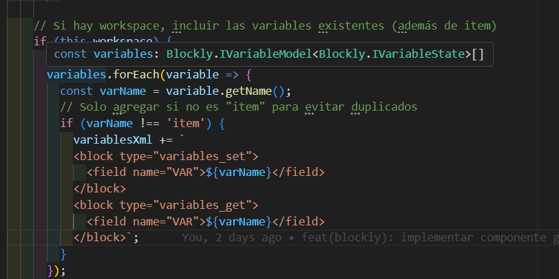

# Portada

<div align="center">
  
</div>

**Manual de Documentación del Código**  
**Logic Programming**  
Universidad Ejemplo  
Ingeniería de Software  
Nombre del estudiante  
Nombre del profesor  
Ciudad, País  
Agosto 2025

---


# Tabla de Contenido

- [Portada](#portada)
- [Tabla de Contenido](#tabla-de-contenido)
- [Estructura del Proyecto](#estructura-del-proyecto)
- [Principales Archivos y Carpetas](#principales-archivos-y-carpetas)
- [Convenciones de Código](#convenciones-de-código)
- [Ejemplo de Documentación](#ejemplo-de-documentación)
- [Ejemplo Visual de Código](#ejemplo-visual-de-código)
- [Bibliografía](#bibliografía)

---


# Estructura del Proyecto

El proyecto sigue la arquitectura estándar de Angular, con módulos, componentes, servicios y assets bien organizados. La estructura facilita la escalabilidad y el mantenimiento del código.

<div align="center">
  
</div>

---


# Principales Archivos y Carpetas

- `src/app/`: Componentes, módulos y servicios principales.
- `src/assets/`: Imágenes y archivos JSON de ejercicios.
- `main.js`: Entrada principal de Electron.
- `electron-builder.yml`: Configuración de empaquetado.
- `documentos/`: Manuales y documentación del proyecto.

---


# Convenciones de Código

- Uso de TypeScript y Angular 16.
- Componentes y servicios documentados con comentarios JSDoc.
- Nombres descriptivos y en inglés para clases y métodos.
- Separación clara entre lógica de negocio y presentación.
- Uso de interfaces para tipado estricto.
- Buenas prácticas de modularidad y reutilización.

---


# Ejemplo de Documentación

```typescript
/**
 * Inicializa el workspace de Blockly en el div especificado.
 * @param element Elemento HTML donde se renderiza Blockly
 * @returns Instancia de Blockly.WorkspaceSvg
 */
initializeWorkspace(element: HTMLElement): Blockly.WorkspaceSvg { ... }
```

# Ejemplo Visual de Código

<div align="center">
  
</div>

---


# Bibliografía

American Psychological Association. (2020). *Publication manual of the American Psychological Association* (7th ed.). https://doi.org/10.1037/0000165-000

Angular. (2025). Documentación oficial. https://angular.io/

Electron. (2025). Documentación oficial. https://www.electronjs.org/docs

Blockly. (2025). Documentación oficial. https://developers.google.com/blockly

Repositorio del proyecto: https://github.com/Napssters/logic-programming

Documentación oficial de Electron. (2025). https://www.electronjs.org/docs

Documentación oficial de Blockly. (2025). https://developers.google.com/blockly

Repositorio del proyecto: https://github.com/Napssters/logic-programming
