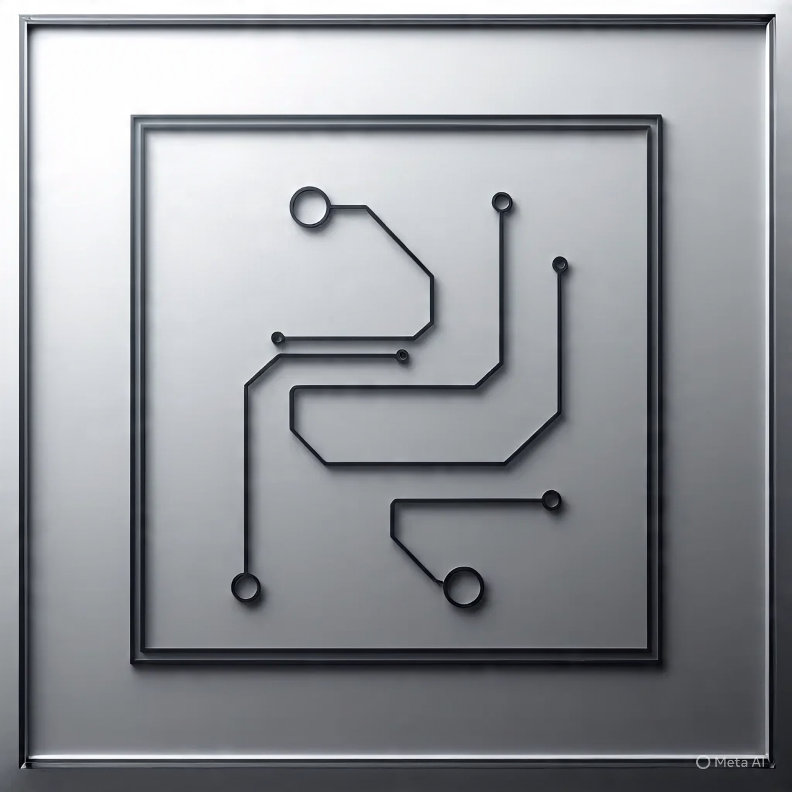
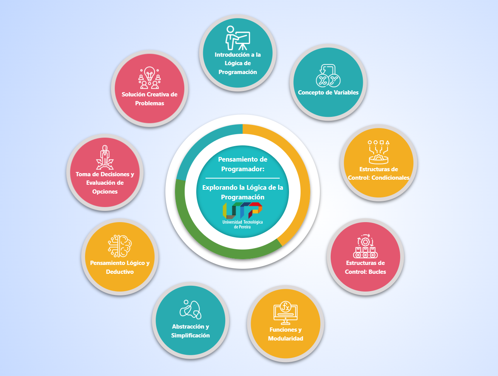
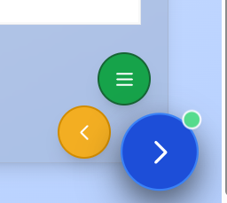
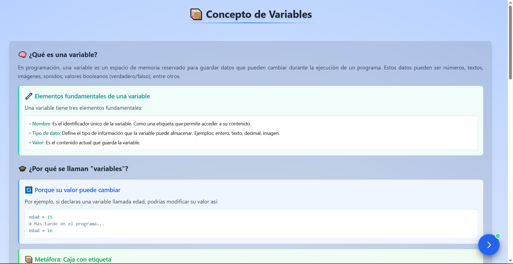
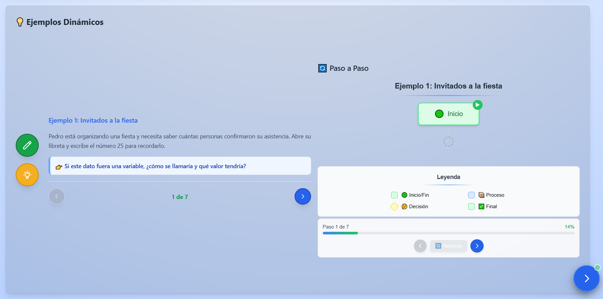
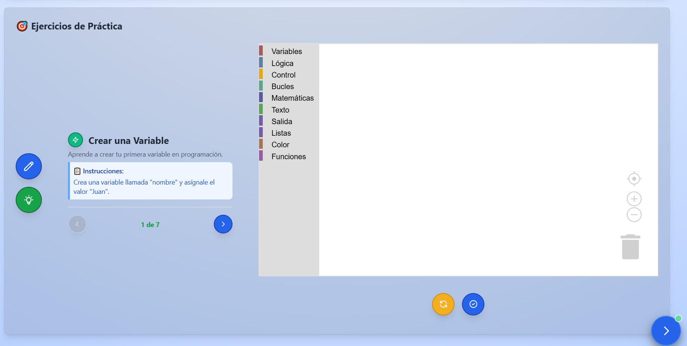
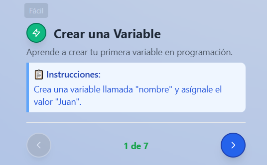
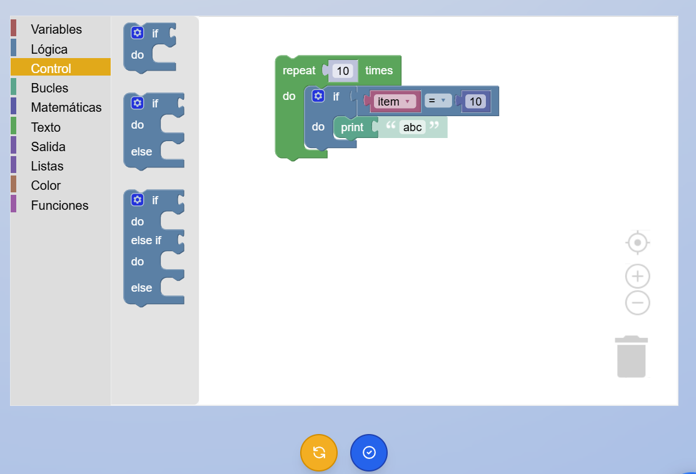
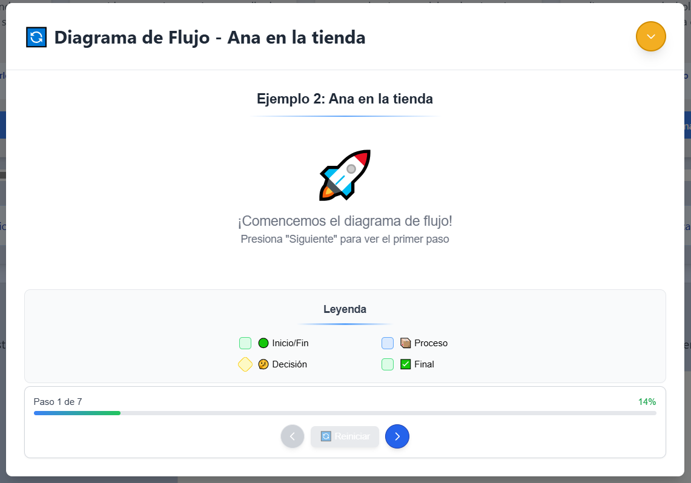
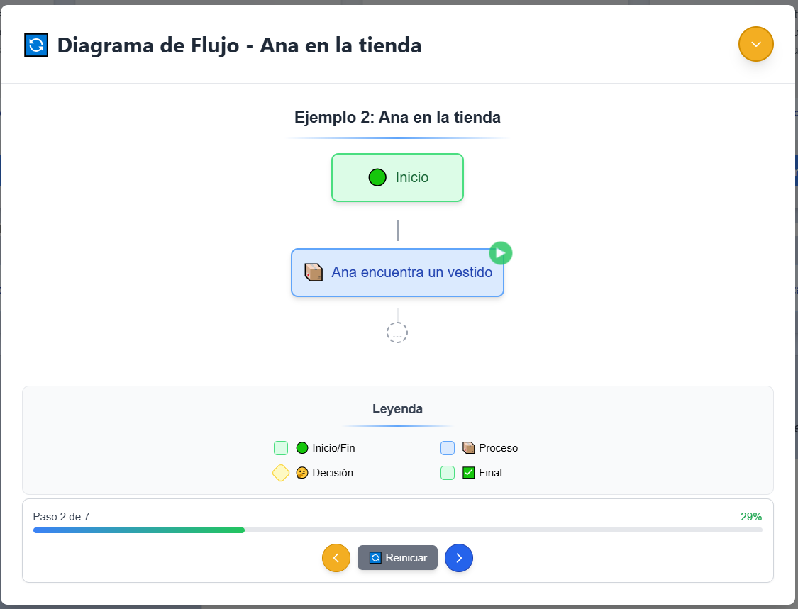

title: Manual de Usuario
subtitle: Logic Programming
institution: Universidad Ejemplo
course: Ingeniería de Software
student: Nombre del estudiante
professor: Nombre del profesor
city: Ciudad
country: País
fecha: Agosto 2025

# Portada

  

**Manual de Usuario**  
**Logic Programming**  
Universidad Ejemplo  
Ingeniería de Software  
Nombre del estudiante  
Nombre del profesor  
Ciudad, País  
Agosto 2025

---

# Tabla de Contenido

1. [Introducción](#introducción)
2. [Pantalla de Inicio](#pantalla-de-inicio)
3. [Navegación General](#navegación-general)
4. [Módulos y Secciones](#módulos-y-secciones)
5. [Ejercicios Interactivos](#ejercicios-interactivos)
6. [Gestión de Progreso y Configuración](#gestión-de-progreso-y-configuración)
7. [Preguntas Frecuentes](#preguntas-frecuentes)
8. [Bibliografía](#bibliografía)

---

# Introducción

Logic Programming es una aplicación de escritorio interactiva para aprender lógica de programación de manera visual y práctica. Permite explorar teoría, ejemplos cotidianos y resolver ejercicios con bloques (Blockly), facilitando el aprendizaje autónomo y progresivo.

---

# Pantalla de Inicio

Al abrir la aplicación, verás la pantalla de bienvenida con el logotipo y acceso al menú principal. Aquí puedes seleccionar el módulo que deseas explorar. Cada tarjeta representa un módulo temático, mostrando su título, una breve descripción y una imagen ilustrativa.

  

Al pasar el mouse sobre una tarjeta, esta se voltea mostrando el número de módulo y una descripción ampliada. Haz clic en la tarjeta para ingresar al módulo seleccionado.

#

---

# Navegación General y Cambio de Módulo

Una vez dentro de un módulo, la navegación entre módulos se realiza mediante un botón flotante ubicado en la esquina inferior derecha. Este botón principal permite avanzar al siguiente módulo. Al acercar el mouse, aparecen dos botones adicionales:

- **Botón Anterior**: Permite regresar al módulo anterior. Está deshabilitado si ya estás en el primer módulo.
- **Botón Menú**: Te lleva de vuelta al menú principal para seleccionar otro módulo.
- **Botón Siguiente**: Avanza al siguiente módulo. Está deshabilitado si ya estás en el último módulo.

  

---

# Estructura de los Módulos: Teoría, Ejemplos y Ejercicios

Cada módulo está compuesto por tres secciones principales, accesibles desde la parte superior o mediante botones internos:

## 1. Teoría
Presenta los conceptos fundamentales de lógica de programación con explicaciones claras y diagramas. Aquí se visualizan los contenidos teóricos del módulo, navegando entre páginas de teoría usando los botones de avance y retroceso.

  

## 2. Ejemplos y Diagramas de Flujo
Incluye ejemplos cotidianos y diagramas de flujo para ilustrar la aplicación de los conceptos. Al hacer clic en los cards de ejemplo, se abre un modal mostrando el diagrama de flujo correspondiente al ejercicio o ejemplo seleccionado.

  

## 3. Ejercicios Interactivos
Permite resolver retos prácticos usando bloques visuales (Blockly). Cada ejercicio muestra instrucciones, nivel de dificultad, y controles para navegar entre ejercicios.

---

# Ejercicios Interactivos y Controles Detallados

En la sección de ejercicios, la pantalla se divide en dos columnas:

- **Columna izquierda**: Muestra el título, dificultad (con icono y color), descripción, instrucciones y los controles de navegación de ejercicios.
- **Columna derecha**: Área de trabajo de Blockly para construir la solución.

  

### Controles de Ejercicio

- **Botón Anterior**: Retrocede al ejercicio anterior. Deshabilitado si es el primero.
- **Contador**: Indica el número de ejercicio actual y el total.
- **Botón Siguiente**: Avanza al siguiente ejercicio. Deshabilitado si es el último.

  

### Controles de Blockly (parte inferior del área de bloques)

- **Botón Reiniciar**: Borra todos los bloques y reinicia el ejercicio.
- **Botón Validar**: Comprueba si la solución es correcta. Si es correcta, muestra un mensaje de éxito; si no, muestra un mensaje de error.

  

### Mensajes y Retroalimentación

Al validar, pueden aparecer mensajes emergentes:

- **Mensaje de éxito**: Fondo verde, indica que la solución es correcta.
- **Mensaje de error**: Fondo rojo, indica que la solución es incorrecta y permite intentar de nuevo.

  

  

### Creación de Variables

En algunos ejercicios, puedes crear variables personalizadas. Al hacer clic en el botón correspondiente, se abre un modal para ingresar el nombre de la nueva variable.

# Gestión de Progreso y Configuración

El progreso de los ejercicios se guarda automáticamente en tu equipo. Puedes cerrar la aplicación y continuar más tarde sin perder tu avance. Desde el menú de configuración puedes:

- Cambiar el tema visual (claro/oscuro).
- Restablecer el progreso de todos los módulos.
- Ajustar preferencias de accesibilidad y visualización.

---

# Preguntas Frecuentes

**¿Necesito internet para usar la app?**  
No, funciona completamente offline.

**¿Pierdo mi progreso si cierro la app?**  
No, el progreso se guarda localmente.

**¿Puedo usar la app en varios computadores?**  
Sí, solo debes copiar el archivo `.exe` y la carpeta de datos si quieres mantener tu progreso.

**¿Cómo accedo a los módulos de teoría, ejemplos y ejercicios?**  
Desde el menú principal, haz clic en la tarjeta del módulo que deseas explorar. Usa los botones flotantes para cambiar de módulo en cualquier momento.

**¿Qué hago si no veo los bloques en los ejercicios?**  
Verifica que la ventana esté maximizada o ajusta el zoom desde la configuración.

**¿Para qué sirve el botón de menú flotante?**  
Permite regresar al menú principal desde cualquier módulo.

**¿Qué significan los colores y los iconos de los botones?**  
El color azul indica avance, el amarillo retroceso, el verde acceso al menú. Los iconos de flecha y menú ayudan a identificar la función de cada botón.

---

# Bibliografía

American Psychological Association. (2020). *Publication manual of the American Psychological Association* (7th ed.). https://doi.org/10.1037/0000165-000

Angular. (2025). Documentación oficial. https://angular.io/

Electron. (2025). Documentación oficial. https://www.electronjs.org/docs

Blockly. (2025). Documentación oficial. https://developers.google.com/blockly

Repositorio del proyecto: https://github.com/Napssters/logic-programming
